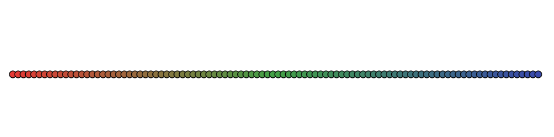

# Myterial

[](https://fedeclaudi.github.io/Myterial.jl/stable)
[](https://fedeclaudi.github.io/Myterial.jl/dev)
[](https://github.com/fedeclaudi/Myterial.jl/actions/workflows/CI.yml?query=branch%3Amain)
[](https://codecov.io/gh/fedeclaudi/Myterial.jl)


## A simple colors package.


Importing `MyterialColors` imports several named colors (hex colors) in the name space:
```julia
using MyterialColors


print(salmon, indigo)  # prints: #FF7043, #5C6BC0
```


### colors methods
In addition, `MyterialColors` exports two colors types: `Hex` and `RGB`.

```julia
rgb = RGB(255, 255, 255)
hex = Hex("#ffffff")
```

and methods to convert bewtween the two:
```julia
hex = Hex(RGB(255, 255, 255))  # or rgb2hex(255, 255, 255)
rgb = RGB(Hex(salmon))  # or hex2rgb(salmon)
```


### Palette
`MyterialColors` also offers methods to create palettes of colors.

```julia

palette = Palette(red_dark, gree_dark, indigo_dark)  # or Palette(Hex(salmon), Hex(indigo))

using Plots
plot(palette)
```
